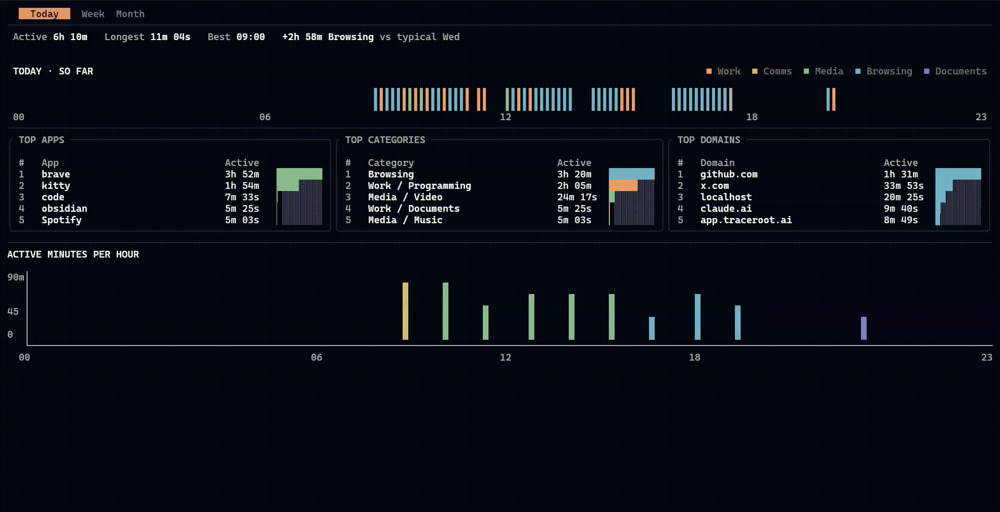

# Daylog

Terminal screen-time tracker for Linux.



```bash
cargo install daylog-tui --locked
daylog
```

## What it does

Daylog tells you where your time on this computer goes — which apps, which categories, which hours of the day. Today, this week, this month. It reads a local activity log and shows the breakdown in your terminal. No cloud, no account, no GUI to install.

I built it because every screen-time tool I tried either wanted me to send data to a server, or didn't run on a tiling window manager.

## Install

### Arch Linux (AUR)

```bash
yay -S daylog-bin       # or: paru -S daylog-bin
```

### Prebuilt binary (no Rust toolchain needed)

```bash
curl -L https://github.com/Manas-Kenge/Daylog/releases/latest/download/daylog-x86_64-unknown-linux-gnu.tar.gz | tar -xz
./daylog
```

Move it onto `$PATH` (e.g. `~/.local/bin/daylog`) to keep it around.

### Via Cargo

Published to crates.io as `daylog-tui`; the executable is `daylog`:

```bash
cargo install daylog-tui --locked
```

Requires a Rust toolchain (`rustup default stable`) and a C toolchain — `rusqlite` builds SQLite from source. On Debian/Ubuntu: `apt install build-essential`. On Arch/Omarchy: `pacman -S base-devel`. On Fedora: `dnf install gcc`.

On first launch, daylog detects whether a local activity tracker is running. If not, it offers to install one (a single Y/N prompt). The installer is fully userspace — no sudo, no system packages.

## Quick start

```bash
daylog                       # open the dashboard (prompts for tracker install on first run)
daylog --setup               # re-run the tracker installer
daylog --uninstall-tracking  # stop and remove the bundled tracker (keeps your data)
daylog --help                # full usage
daylog --version             # print version
```

## Status bar integration

`daylog --json today` prints today's KPIs as a single JSON object to stdout. Safe to poll on a short interval; exits 0 even when there's no data yet.

```json
{
  "as_of": "2026-05-17T11:45:00+05:30",
  "today": {
    "total_active": "PT4H32M",
    "top_app":      { "name": "kitty", "duration": "PT2H10M" },
    "top_category": { "name": "Work > Programming", "duration": "PT3H5M" },
    "hours":        [0, 0, 0, 0, 0, 0, 0, 0, 12, 47, 60, 60, 0, 0, 0, 0, 0, 0, 0, 0, 0, 0, 0, 0]
  }
}
```

`as_of` is RFC 3339 with local timezone. `total_active` is the sum of non-AFK time today, as an ISO-8601 duration. `top_app` and `top_category` are the highest-duration entries; both are `null` when there's no activity yet. `hours` is 24 ints — minutes of active time per hour, indexed `hours[0]` = 00:00–00:59 local time.

### waybar

```json
"custom/daylog": {
  "exec": "daylog --json today | jq -r '.today.total_active'",
  "interval": 30
}
```

### i3blocks

```
[daylog]
command=daylog --json today | jq -r '.today.total_active'
interval=30
```

## Configuration

Custom category rules live at `~/.config/daylog/categories.json`. Daylog ships with sensible defaults — edit only if you want different buckets.

## Compatibility

x86_64 Linux. Tested on Ubuntu, Debian, Fedora, Arch (incl. Omarchy / EndeavourOS / CachyOS), openSUSE, and derivatives. The tracker uses systemd-user units when available and falls back to XDG-autostart on non-systemd distros (Void, Artix, Devuan).

Display servers: X11, GNOME-Wayland (auto-installs the `focused-window-dbus` shell extension; logout/login once after install), KDE-Wayland, and wlroots compositors (Hyprland, Sway, river, …).

aarch64 and non-Linux platforms aren't supported in the current release.

## Build from source

```bash
git clone https://github.com/Manas-Kenge/Daylog
cd Daylog
cargo build --release -p daylog-tui
./target/release/daylog
```

Single crate, library + binary. `daylog-tui` on crates.io produces a `daylog` executable, with the data layer in `daylog_tui::data` and the TUI on top.

## License

MIT — see [LICENSE](./LICENSE).

Daylog downloads `aw-server-rust` and `aw-awatcher` from the [ActivityWatch](https://activitywatch.net) project (MPL-2.0) on first launch. Full attribution lives in [THIRD-PARTY-NOTICES.md](./THIRD-PARTY-NOTICES.md).
