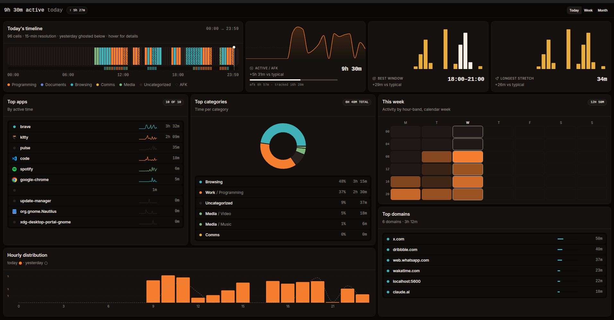

# Daylog

A Linux desktop app that shows you how you spent your time on your computer — broken down by app, category, hour of the day, and website. Today, this week, this month.



Daylog runs entirely on your machine. No cloud, no sign-in, no telemetry.

## Install

```bash
# AppImage — works on most Linux distros
curl -L -o Daylog.AppImage https://github.com/Manas-Kenge/Daylog/releases/latest/download/daylog_0.1.0_amd64.AppImage
chmod +x Daylog.AppImage
./Daylog.AppImage

# Debian / Ubuntu / Mint / Pop!_OS
curl -L -o daylog.deb https://github.com/Manas-Kenge/Daylog/releases/latest/download/daylog_0.1.0_amd64.deb
sudo apt install ./daylog.deb

# Fedora / RHEL / openSUSE
curl -L -o daylog.rpm https://github.com/Manas-Kenge/Daylog/releases/latest/download/daylog-0.1.0-1.x86_64.rpm
sudo dnf install ./daylog.rpm
```

The first launch runs a quick wizard that sets up background tracking. Close the window and tracking keeps going. If you already have ActivityWatch installed, Daylog uses it instead of installing its own copy.

## Want to see the websites you visit?

Daylog can show you a per-domain breakdown of your browser activity — but only if you install the [`aw-watcher-web`](https://github.com/ActivityWatch/aw-watcher-web) browser extension separately. Daylog doesn't bundle it. Without it, the websites panel will be empty.

## Compatibility

Daylog targets x86_64 Linux. Most distros work — Ubuntu, Debian, Fedora, Arch, openSUSE, Mint, Pop!\_OS, Manjaro, EndeavourOS, and the rest of that family.

| Distro | Status | Workaround |
|---|---|---|
| Alpine, Chimera Linux | AppImage won't run (musl libc) | Use [distrobox](https://github.com/89luca89/distrobox) with a glibc container |
| NixOS | No first-party package | Derive a `default.nix` from the AppImage |
| Gentoo | No first-party package | Write an ebuild |
| Void / Artix / Devuan | AppImage works; tracker uses an autostart fallback (no systemd) | Tracking starts at login as usual |

aarch64 isn't supported in v0.1.

## Uninstall

- **`.deb` / `.rpm`:** `sudo apt remove daylog` or `sudo dnf remove daylog` cleanly stops background tracking and removes everything.
- **AppImage:** `./Daylog.AppImage --uninstall-tracking` stops tracking and removes the autostart entry. Then delete the AppImage file.

## Build from source

You'll need [`rustup`](https://rustup.rs), [`bun`](https://bun.sh), and the GTK / WebKitGTK 4.1 development headers. See [`PLAN.md`](./PLAN.md) for distro-specific setup commands.

```bash
bun install --frozen-lockfile
scripts/fetch-binaries.sh    # fetches pinned aw-server-rust + awatcher
bun run tauri dev            # dev mode
bun run tauri build          # full release bundle (.AppImage / .deb / .rpm)
```

## Daylog bundles ActivityWatch

The tracking stack — [`aw-server-rust`](https://github.com/ActivityWatch/aw-server-rust) and [`awatcher`](https://github.com/2e3s/awatcher) — comes from the [ActivityWatch](https://activitywatch.net) project. Both are MPL-2.0 licensed; full attribution lives in [THIRD-PARTY-NOTICES.md](./THIRD-PARTY-NOTICES.md).

## License

MIT — see [LICENSE](./LICENSE).
